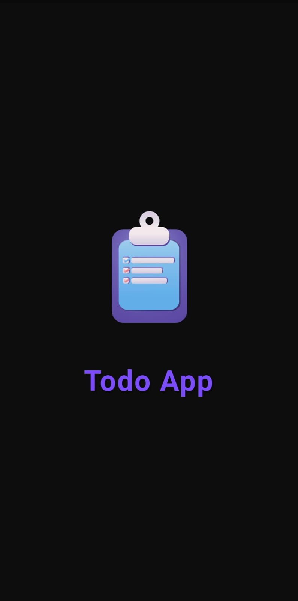
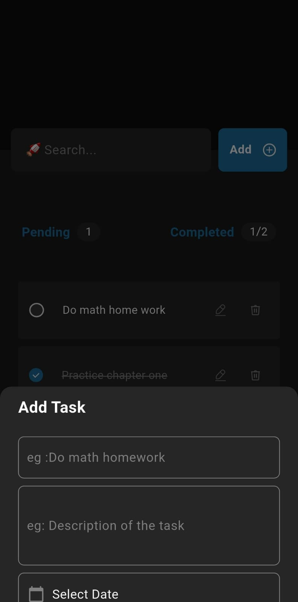
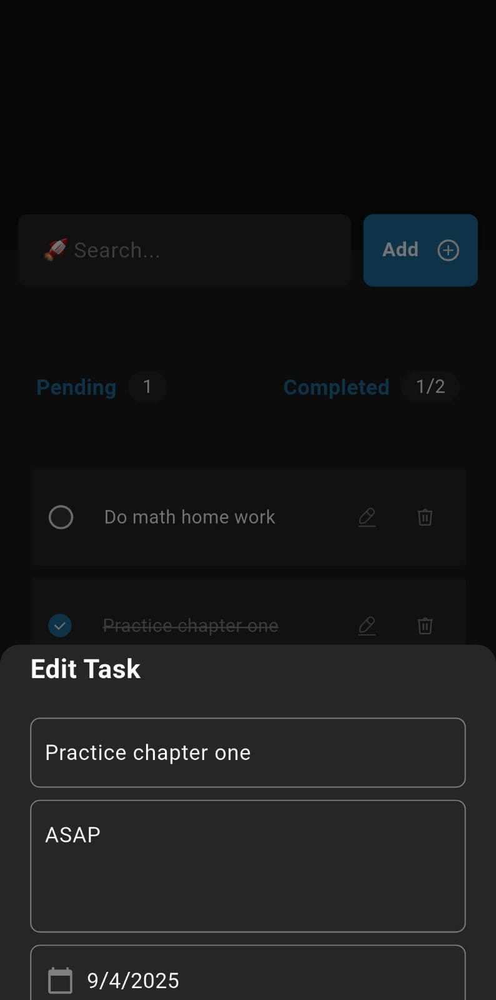

# ✅ To-Do App

A beautifully designed Flutter To-Do List app for managing your daily tasks efficiently.  
Stay organized, set deadlines, and never miss a task again!

---

## 📽️ Demo Video

https://user-images.githubusercontent.com/your-username/demo-video.mp4  
> _(Click above or open in browser to watch the full app demo)_

---

## 📦 Download APK

[⬇️ Download Latest APK](https://github.com/Adilcpgithub/to_do_app/releases/tag/v1.0.0)

> _Click to download and try the app on any Android device._

---

## ✨ Features

- 📝 Create, edit, and delete tasks
- 🗓️ Set custom **due dates** and **times**
- ⏰ time-based organization
- ✅ Mark tasks as completed
- 💾 Data stored  Firebase 
- 📱 Responsive & beautiful UI

---

## 🧠 Tech Stack

- **Flutter** - Frontend UI framework
- **Provider** - State management
- **Dart** - Programming language
- **Firebase** - Data persistence
- **Custom Widgets** - For reusable, clean UI
- **MVVM Architecture** - Clean code structure

---

## 📸 Screenshots

| Home Screen        | Create Task        | Edit Task         |
|--------------------|--------------------|-------------------|
| |  |  |[Search](asset/search screen.jpg) |

> _Place your screenshots inside a folder like `assets/screens/` and link accordingly._

---

### Prerequisites

- Flutter SDK installed
- Android Studio / VS Code
- Dart plugin
